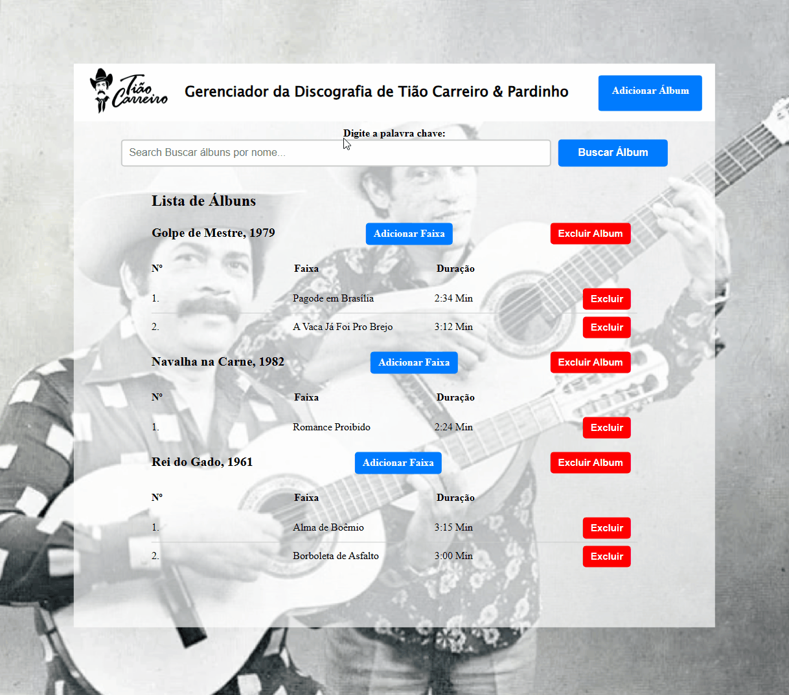

# Gerenciador de Discografia - Tião Carreiro e Pardinho 🤠


## Desafio

Criar interfaces acessíveis através de um browser que permita o usuário a gerenciar a discografia da dupla caipira Tião Carreiro e Pardinho🤠.

### Tecnologias Utilizadas

- JavaScript
- React.js
- Axios
- CSS

## Iniciando o Projeto

Para iniciar o projeto, siga os passos abaixo:

1. Clone o repositório para a sua máquina local:

    ```
    git clone https://github.com/Brunonavarrooficial/DesafioTecnico_ReactJS_SupliuTecnologia.git
    ```

2. Instale as dependências do projeto:
    ```
    cd nome-do-repositorio
    npm install`
    ```

3. Crie o arquivo `.env` na raiz do projeto e configure as variáveis de ambiente:

    ```
    REACT_APP_API_URL=coloque_sua_api
    REACT_APP_API_KEY=coloque_seu_toquem
    ```

4. Inicie o servidor de desenvolvimento:

    ```
    npm start
    ```

5. Abra o projeto no seu navegador:

    ```
    http://localhost:3000
    ```


## Funcionalidades do Projeto

- Segue abaixo as ações que o usuário poderá executar:
    - As interfaces foram criadas utilizando a biblioteca React.js 
    - os métodos da API REST disponível no link https://tiao.supliu.com.br/ foram consumidos.

- Ver lista de álbuns e faixas
- Pesquisar álbuns por nome
- Adicionar um novo álbum
- Adicionar uma nova faixa em um álbum
- Excluir uma faixa
- Excluir um álbum


## Validação de Formulários

Os formulários têm validações para evitar requisições desnecessárias à API.

## Responsividade

Foram adicionados @media-query nos arquivos CSS para garantir a responsividade do projeto em dispositivos móveis, tablets e outros.

## Transformação de Duração de Faixa

No formulário de adicionar faixa, a aplicação permite que você insira o tempo da faixa em segundos completos e automaticamente faz a transformação para minutos e segundos (Exemplo: 195 seg se tornará 3:15 min).

## Configuração do arquivo .env

- Um arquivo .env-exemplo foi fornecido para configurar as variáveis de ambiente necessárias para o projeto:
    - Lembre-se de substituir `seu-usuario`, `nome-do-repositorio` e outras informações relevantes pelos valores corretos do seu projeto.

#


<div align ='center'>
    <h3>Projeto 🤠🎸</h3>
    
    <h6>Uma pequena demonstração da interface</h6>
</div>

- #### . Happy Hacking! 🚀